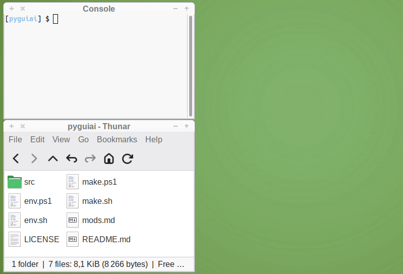

# pyguiai

A small training project demonstrating how to build a desktop
chat interface using **Python**, **PyQt6**,
and an **OpenAI‑compatible API**.

The application focuses on clarity, modularity, and learnability
ideal for experimenting with GUI programming, streaming responses,
and event‑driven architecture.


---
## #Demo

Running on Ubuntu 24.04 x86_64
<br>
<div style="text-align: center;">
  
</div>

---

## #Python
- Clean, modular engine (`core.py`)
- Background worker threads for streaming
- Simple in‑memory conversation state
- Easy to extend and modify

## #PyQt6
- Responsive GUI with:
  - Prompt input
  - Scrollable conversation context
  - Single‑line status logger
  - Zoom controls
  - Clear / Append / Exit actions
- Accessible layout and readable typography

## #OpenAI‑API (compatible)
- Uses a streaming Chat Completions endpoint
- Token‑by‑token updates for smooth UI output
- Works with any provider following the OpenAI schema

---

## Features

### **Accessible UI**
- High‑contrast text
- Adjustable zoom
- Clear separation between prompt and assistant sections

### **Logging**
- Logs to **console** for development
- Logs to **file** for debugging and reproducibility
- Single‑line status logger in the GUI

### **Evolving Context**
- Each user prompt is appended to the conversation
- Assistant replies are streamed and added in real time
- Context grows naturally with each turn
- Optional “Append” feature to load external text into the chat

### **Event‑Driven Architecture**
- GUI → Engine → Model → GUI loop
- Queue‑based message passing
- Clean separation of responsibilities

---

## Platform Notes

### Windows
If you are on **Windows**, use:

- `make.bat` — main project helper (venv setup, run, clean)
- `env.bat` — environment variables (WORK_PATH, API keys)

Run it from Command prompt or Windows 11 Desktop:

```batch
.\make.bat
```

### Linux
If you are on **Linux**, use:

- `make.sh` — main project helper (venv setup, run, clean, shell)
- `env.sh` — environment variables (WORK_PATH, API keys)

Run it from Bash or Xfce4 desktop if script execution allowed:

```bash
.\make.sh
```

# License
-------

Copyright (c) 2026 alexander14k28@gmail.com

See [LICENSE](LICENSE) for the license governing this project.
